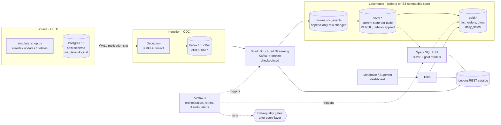

# Capstone - "Olist Real-Time Commerce Lakehouse"

| | |
|---|---|
| Module | 12 - Capstone (uses everything from L04-L12) |
| Team size | 2-3 students |
| Duration | 3-4 weeks (4 milestones) |
| Deliverables | Git repo, running pipeline (demo video or live), dashboard, 6-8 page report, 10-min presentation |

## 1. The business story

Olist, a Brazilian e-commerce marketplace, runs its shop on a Postgres OLTP database. The analytics team today exports CSV
files every night and builds reports in spreadsheets. Management wants:

1. **Fresh numbers**: revenue, orders and late deliveries visible within **~15 minutes** of an order changing in the shop.
2. **History you can trust**: every change (including cancellations and deletions) kept, reproducible reports "as of" any date.
3. **One source of truth**: a star schema that analysts can query with SQL and a dashboard for managers.
4. **No silent failures**: bad data must stop the pipeline *before* it reaches the dashboard, and someone must be told.

Your team builds the data platform.

## 2. Reference architecture



Medallion layers:

| Layer | Table(s) | Content | Written by |
|---|---|---|---|
| Bronze | `lake.bronze.cdc_events` | Every Debezium event as received (topic, partition, offset, key, op, `before`/`after` JSON, ts) - append only, partitioned by `source_table`, `days(ingested_at)` | Spark Structured Streaming |
| Silver | `lake.silver.orders`, `customers`, `order_items`, `order_payments`, `products`, `sellers` | Current state of each source table, typed columns, deletes applied, de-duplicated | Spark SQL `MERGE INTO` (or dbt incremental) |
| Gold | `lake.gold.fact_orders`, `fact_order_items`, `dim_customers`, `dim_products`, `dim_sellers`, `dim_date`, `daily_sales` | Star schema + aggregates for BI | Spark SQL (reference) or dbt (dbt-trino / dbt-spark) |

## 3. Running it on an 8 GB laptop - stages (compose profiles)

Everything at once needs ~7-8 GB of RAM for Docker - more than an 8 GB Mac can give. The reference `docker-compose.yml`
is split into **profiles**; you run one *stage* at a time. Data survives between stages because it lives in Docker volumes
(Postgres, Kafka, object store, catalog, checkpoints).

| Stage | Command | Services | RAM (approx.) |
|---|---|---|---|
| core (always) | `docker compose up -d` | postgres, kafka, seaweedfs, iceberg-rest | 1.3 GB |
| 1. ingest | `docker compose --profile ingest up -d` | + debezium connect, spark (Spark Connect server) | +1.9 GB = 3.2 GB |
| 2. batch | `docker compose stop connect` then `docker compose --profile batch up -d` | spark (kept) + airflow (api-server, scheduler, dag-processor, metadata DB) | ~1.3 + 1.2 + 1.5 = ~4 GB (connect stopped) |
| 3. serve | `docker compose --profile ingest --profile batch --profile serve stop` then `docker compose --profile serve up -d trino metabase` | seaweedfs, iceberg-rest, trino, metabase (Postgres/Kafka not needed) | ~2.5 GB measured (Metabase 1.2, Trino 0.9-1.0, store + catalog 0.4) |

Recommended loop on a laptop:

1. `core` + `ingest`: register the connector, run `simulate_shop.py` for a few minutes, run the bronze ingestion (streaming
   with `availableNow` trigger - it processes everything new in Kafka, commits the checkpoint and stops).
2. Stop `connect`; start `batch`; let the Airflow DAG run bronze -> DQ -> silver -> DQ -> gold -> DQ.
3. Stop everything; start only `trino` + `metabase` (they pull in seaweedfs + iceberg-rest); build the dashboard on Trino (section 6.3).

**Cloud / lab-machine option** (recommended for the final demo): a single VM with 16 GB RAM (e.g. a university lab PC,
AWS `t3.xlarge`/`m7g.xlarge`, GCP `e2-standard-4`, Azure `D4s v5`) runs all profiles simultaneously:
`docker compose --profile ingest --profile batch --profile serve up -d`. Stop the VM when not in use. On managed cloud
the same design maps to: RDS Postgres -> MSK Connect/Debezium -> MSK -> EMR/Glue Spark -> S3 + Glue/REST catalog -> Athena/Trino ->
QuickSight/Superset, orchestrated by MWAA (managed Airflow).

## 4. What you must build (requirements)

**R1 - CDC ingestion.** Debezium captures all six Olist tables into Kafka. Snapshot + streaming. Documented connector config.

**R2 - Bronze.** A Spark Structured Streaming job writes *all* change events to an Iceberg bronze table with a checkpoint.
Show that killing and restarting it neither loses nor duplicates events (prove with Kafka offsets vs bronze counts).

**R3 - Silver.** Current-state tables per source table, built incrementally with `MERGE INTO` (updates and deletes applied,
latest event per key wins by LSN). Schema documented.

**R4 - Gold.** A star schema (at least `fact_orders` + 3 dimensions + `dim_date`) and one aggregate table used by the dashboard.
Either Spark SQL (reference) or dbt (+10% bonus if dbt with tests and docs).

**R5 - Data quality gates.** At least 6 checks across layers (row counts, uniqueness, not-null FKs, referential integrity,
accepted values, freshness, reconciliation of gold revenue vs silver payments). A failed check **stops** downstream tasks.

**R6 - Orchestration.** An Airflow 3 DAG (or two DAGs connected by an Asset) running the batch part on a schedule with retries,
templated dates, and a failure notification (callback that logs/writes a file/posts to a webhook).

**R7 - Serving.** A dashboard with at least 4 charts: daily revenue, orders by status, late-delivery rate by state, top categories.
Numbers must match a SQL query you show in the report.

**R8 - Operations.** Iceberg maintenance (compaction, snapshot expiry) scheduled; a runbook: how to replay from bronze,
how to backfill a day, what to do when the replication slot grows.

**Stretch ideas** (pick at most 2 for bonus): Avro + schema registry; SCD type 2 for customers (dbt snapshot or Iceberg
MERGE); Flink SQL instead of Spark for bronze; real Kaggle dataset (99k orders); alerting to Slack/Discord; Great Expectations/Soda;
CI (GitHub Actions running `dbt build` + unit tests on every push).

## 5. Reference skeleton in this folder

| Path | What it is | Status |
|---|---|---|
| `docker-compose.yml` | All services with profiles `ingest`, `batch`, `serve` | reference |
| `connectors/olist-cdc.json` | Debezium connector (all 6 tables) | complete |
| `scripts/simulate_shop.py` | Generates realistic OLTP traffic (new orders, status changes, cancellations, deletes) | complete |
| `spark/jobs/bronze_ingest.py` | Kafka -> `lake.bronze.cdc_events` (Structured Streaming, `availableNow` or continuous) | complete |
| `spark/jobs/silver_merge.py` | bronze -> silver via `MERGE INTO`, generic for all 6 tables (latest event per key, deletes applied) - but re-reads the whole bronze table every run | works; **your job**: make it incremental, quarantine bad events |
| `spark/jobs/gold_build.py` | silver -> gold star schema (skeleton with `fact_orders` + `daily_sales`) | partial - **your job** |
| `spark/jobs/dq_checks.py` | Tiny data-quality framework (SQL assertions, non-zero exit on failure) + example checks | partial - **your job** |
| `spark/jobs/common.py` | Spark Connect session helper | complete |
| `airflow/dags/capstone_pipeline.py` | DAG: bronze -> DQ -> silver -> DQ -> gold -> DQ -> publish Asset | reference |
| `conf/spark-defaults.conf` | Spark Connect server config (Iceberg REST catalog + S3) | complete |
| Trino config | mounted read-only from `../L11_lakehouse_iceberg/trino/` (same `lake` catalog as L11) | complete |
| `scripts/metabase_bootstrap.py` | Optional: Metabase admin user + Trino connection + ONE example question/dashboard (stdlib only) | complete |
| `RUBRIC.md`, `MILESTONES.md`, `INSTRUCTOR_NOTES.md` | Grading + plan | - |

The Spark jobs are executed **through Spark Connect** (`sc://spark:15002`): the `spark` container runs a long-lived Spark
Connect server with the Iceberg and Kafka packages; Airflow tasks and your laptop use the thin `pyspark-client` (no JVM),
which keeps the Airflow image small.

## 6. Getting started (Milestone 1 smoke test)

```bash
cd labs/capstone
docker compose up -d                                   # core: postgres, kafka, seaweedfs, iceberg-rest
docker compose --profile ingest up -d                  # + connect, spark (Spark Connect server)
./scripts/register_connector.sh                        # POST connectors/olist-cdc.json
python3 -m venv .venv && source .venv/bin/activate && pip install -r requirements.txt
python scripts/simulate_shop.py --minutes 2            # OLTP traffic
python spark/jobs/bronze_ingest.py --available-now     # Kafka -> bronze (runs until caught up, then exits)
python spark/jobs/silver_merge.py
python spark/jobs/gold_build.py
python spark/jobs/dq_checks.py --layer gold
```

The Python scripts connect to Spark Connect on `sc://localhost:15002` and to Postgres on `localhost:5433`
(the capstone uses 5433 so it does not clash with L08/L12).

### 6.1 Stage 1 - ingest (expected results)

`register_connector.sh` prints `created` and a status with `"state":"RUNNING"` for the connector and task 0
(the first start of Connect takes ~1 min). `simulate_shop.py --minutes 2` ends with `done: ~230 business events`;
`bronze_ingest.py --available-now` prints `bronze.cdc_events rows: ~23,700` (5,000-order snapshot of all 6 tables + the
simulated changes) and exits after ~20 s.

### 6.2 Stage 2 - batch (Airflow)

```bash
docker compose stop connect                            # free ~1 GB
docker compose --profile batch up -d --build           # first run builds de-labs/airflow:3.3.2-capstone (~2-3 min)
docker compose exec airflow-scheduler airflow dags unpause capstone_pipeline
docker compose exec airflow-scheduler airflow dags trigger capstone_pipeline
docker compose exec airflow-scheduler airflow dags list-runs capstone_pipeline   # wait for state=success (~1 min)
```

Airflow UI: <http://localhost:8080> (SimpleAuthManager, everybody is admin - no login). Unpausing also starts the
latest `*/30` scheduled run, so you usually see two successful runs. Afterwards the gold tables exist
(reference skeleton + the 2-minute simulation): `fact_orders` ~5,100 rows, `dim_customers` ~5,030, `dim_date` 4,383,
`daily_sales` ~2,800.

### 6.3 Stage 3 - serve: Trino + Metabase dashboard

```bash
docker compose --profile ingest --profile batch --profile serve stop   # stop everything (data stays in volumes)
docker compose --profile serve up -d trino metabase                  # + seaweedfs, iceberg-rest as dependencies
docker compose --profile serve ps                                     # wait until trino AND metabase are "healthy" (~1-2 min)
```

Only Trino, Metabase, the object store and the REST catalog run (~2.5 GB measured; Postgres/Kafka are not needed to
read gold). **Check gold in Trino first** (Trino UI <http://localhost:8085>, any user name, no password):

```bash
docker exec -it cap-trino trino --catalog lake --schema gold
trino:gold> SHOW TABLES;                                      -- daily_sales, dim_customers, dim_date, fact_orders
trino:gold> SELECT order_status, count(*) FROM fact_orders GROUP BY 1 ORDER BY 2 DESC;   -- delivered ~4,800 first
trino:gold> SELECT round(sum(revenue), 2), sum(orders) FROM daily_sales;                -- sum(orders) = count(fact_orders)
```

**Connect Metabase** - open <http://localhost:3000>, create the admin account, then *Add a database*
(or Admin settings -> Databases -> Add database):

| Field | Value | Why |
|---|---|---|
| Database type | **Starburst (Trino)** | bundled with Metabase 0.63 (engine `starburst`); no plugin jar needed |
| Display name | `Lakehouse (Trino)` | any |
| Host | **`trino`** | Metabase runs in Docker: use the container name, *not* `localhost` |
| Port | **`8080`** | the container port; `8085` is only the port published to your laptop |
| Catalog | `lake` | Trino catalog file `L11_lakehouse_iceberg/trino/catalog/lake.properties` |
| Schema (optional) | `gold` | Metabase then syncs only the 4+ gold tables |
| Username | `metabase` (anything) | Trino has no authentication in this stack; leave Password empty, SSL off |

After the sync (a few seconds) *Browse data -> Lakehouse (Trino)* lists `Daily Sales`, `Dim Customers`, `Dim Date`,
`Fact Orders`. Build questions either with the query builder (e.g. *Fact Orders -> Count -> by Order Status ->
Visualize -> Bar*) or with *New -> SQL query*, e.g. daily revenue as a line chart:

```sql
SELECT date_day, round(sum(revenue), 2) AS revenue, sum(orders) AS orders
FROM lake.gold.daily_sales GROUP BY date_day ORDER BY date_day
```

Save each question and add it to a dashboard (*New -> Dashboard*). Shortcut that does the connection + this one example
question + a dashboard for you (stdlib only, run from your venv):

```bash
python scripts/metabase_bootstrap.py
# admin user created: admin@capstone.local / Capstone-2026!
# database added: id=2 (starburst -> trino:8080 / lake.gold)
# question id=.. returned 608 rows; last 3: [['2018-08-30T00:00:00Z', 3942.87, 14], ..., ['<today>', ..., ...]]
# dashboard: http://localhost:3000/dashboard/2
```

Expected: the line chart shows the seeded history (2016-2018, mostly 2017-2018) plus one point for *today* from
`simulate_shop.py`; the "orders by status" bar chart is dominated by `delivered`; every number must equal the same SQL
run in Trino (that is the R7 reconciliation). Pitfalls:

* In Trino `1.0` is `DECIMAL(2,1)`, so `avg(CASE WHEN is_late THEN 1.0 ELSE 0.0 END)` is rounded to one decimal - use
  `avg(CASE WHEN is_late THEN 1e0 ELSE 0e0 END)` or `avg(CAST(is_late AS integer) * 1e0)` for rates.
* Metabase caches table metadata: after `gold_build.py` adds a table, use *Admin -> Databases -> Sync database schema now*.
* Re-running the batch stage rewrites gold (`CREATE OR REPLACE`) - stop `serve` first on an 8 GB laptop, then start it again;
  saved questions and dashboards survive (Metabase stores them in the `metabase-data` volume).
* *Superset* is an acceptable alternative (SQLAlchemy URI `trino://superset@trino:8080/lake/gold`), but it is not part of
  the reference stack and was not tested here.

## 7. Deliverables and milestones

See [`MILESTONES.md`](MILESTONES.md) (4 checkpoints, what to demo at each) and [`RUBRIC.md`](RUBRIC.md) (100 points + 10 bonus).

## 8. Cleanup

```bash
docker compose --profile ingest --profile batch --profile serve down -v
```
